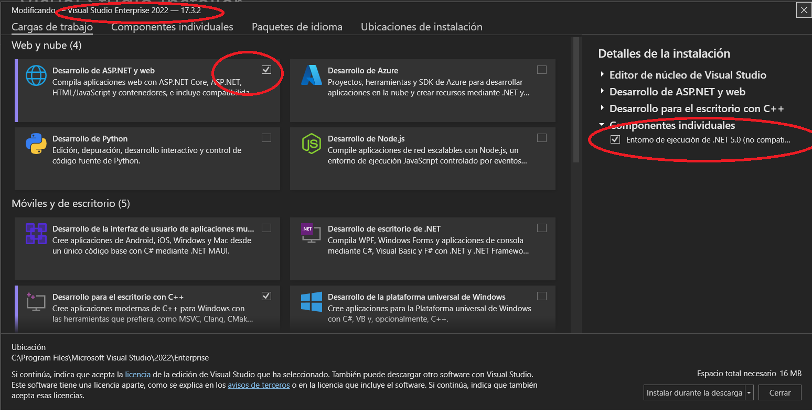
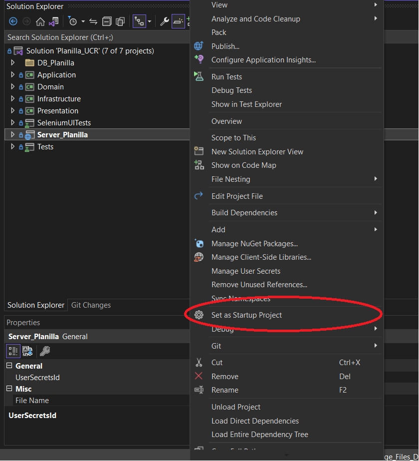
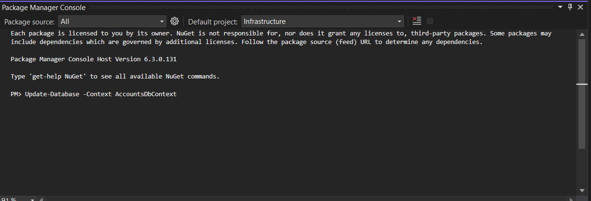
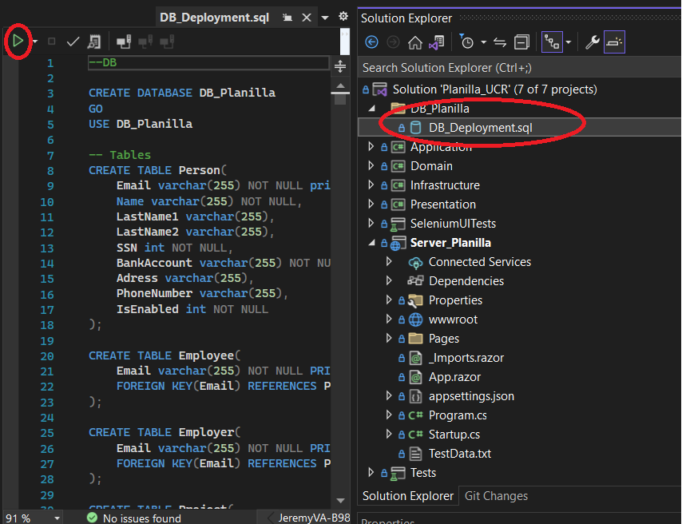
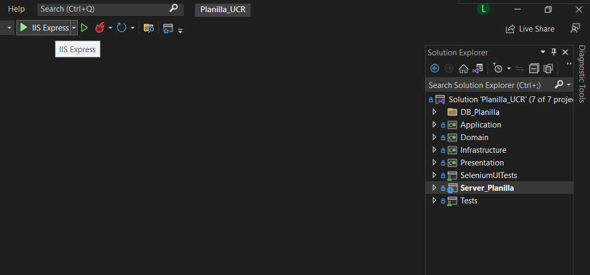

# Planilla_UCR
## Project Overview
The goal of this application is to allow users to pay bills easily, efficiently, and safely. In addition to providing a practical solution for bill payment, the project showcases the application of clean code design principles and a clean architecture based on Domain-Driven Design (DDD) to generate maintainable code, along with thorough unit tests and UI tests.

### Backend
The backend is built with .NET 5.0, handling various operations related to bill payment. It integrates with a SQL Server Database for storing transactional data and utilizes ASP.NET Identity for comprehensive user and role management.

### Frontend
The client side of our app, constructed with Blazor Server, not only delivers a seamless and interactive user experience but also prioritizes security. Harnessing Blazor's robust component-based architecture, our client-side interface ensures responsiveness and efficiency without compromising on safety.

## Key Features
- **Entity Framework**: Entity Framework is used for object-relational mapping, simplifying interactions with the database and enabling rapid development of data-driven applications.
- **SQL Server Database**: SQL Server is employed as the primary database management system, providing robust data storage capabilities for transactional data related to bill payments.
- **Firebase Document Database**: Firebase is utilized as a document database for storing supplementary data, offering scalability and flexibility for non-relational data storage needs.
- **ASP .NET Identity**: Utilized for user and role management, facilitating secure authentication and authorization processes within the application.
- **Scrum Iterations Documentation**: The project follows Agile methodologies, with detailed documentation of Scrum iterations, ensuring clear communication and progress tracking throughout the development lifecycle.
- **Unit-Integration Testing**: Comprehensive unit and integration tests are implemented to validate the functionality.

## Execution instructions
1) Clone the repository locally, using Visual Studio

2) Make sure you have .net 5.0 installed and ASP.net web development

3) Right click on the Server_Planilla project and select it as the start project

4) With the web server as the default project. and the selected infrastructure layer.
From the Package manager console run:
Update-Database -Context AccountsDbContext

5) Run Planilla data base using vs options

6) Click on the button to run using ISSExpress

# Colaborators
● Leonel Campos Murillo. B91545.  
● Nayeri Azofeifa Porras. B90841.  
● Wendy Ortiz Alfaro. B75584.  
● Ronald Mauricio Palma Villegas. B95811.  
● Jeremy Vargas Artavia. B98157.  
