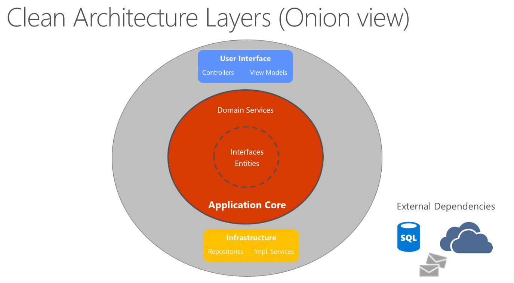
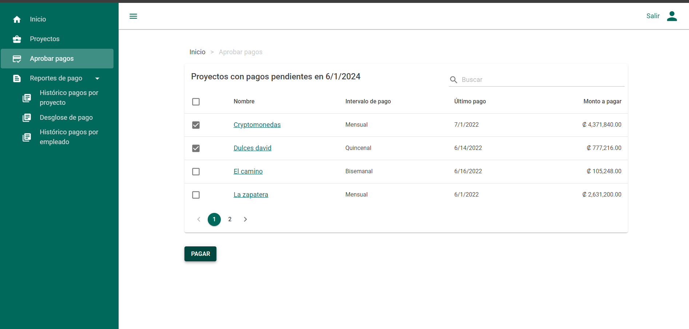
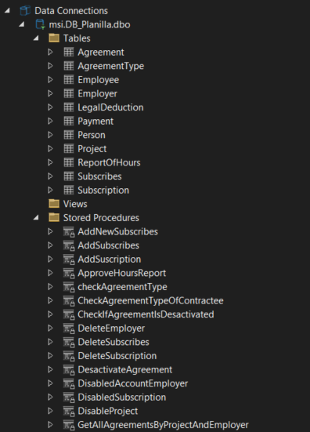
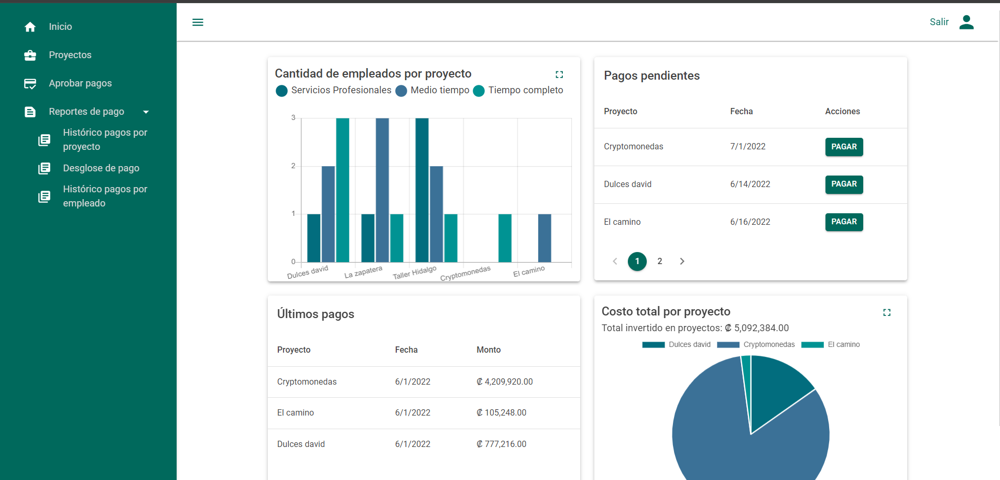
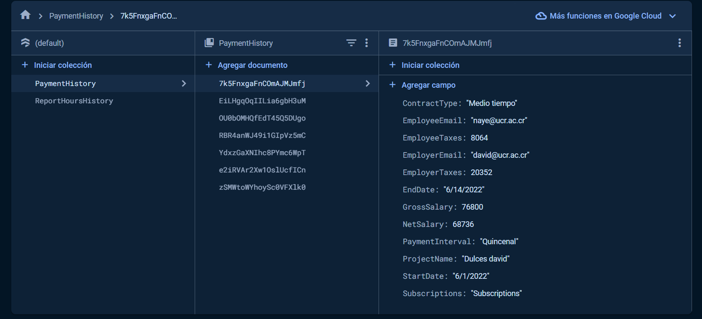
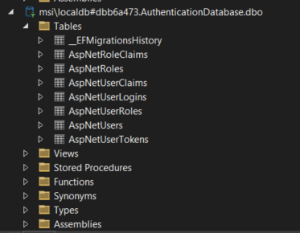
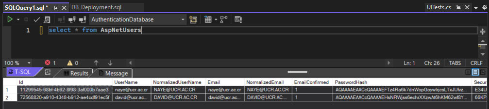
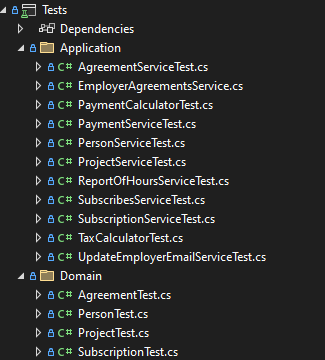
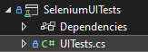

# Planilla_UCR
## Project Overview
The goal of this application is to allow employers to handle payroll easily, efficiently, and safely. In addition to providing a practical solution for bill payment, the project showcases the application of clean code design principles and a clean architecture based on Domain-Driven Design (DDD) to generate maintainable code, along with unit tests, integration tests, and system-Selenium tests.

<a href="https://learn.microsoft.com/en-us/dotnet/architecture/modern-web-apps-azure/common-web-application-architectures#clean-architecture">Clean architecture Explanation</a>

## Monolithic Blazor Server
In monolithic applications, the Application Core, Infrastructure, and UI projects operate as a unified application. This architecture consolidates all components into a single runtime environment, ensuring cohesive operation and streamlined management.

## Key Features
- **Entity Framework**: Entity Framework is used along with .NetCore 5 for object-relational mapping, simplifying interactions with the database and enabling rapid development of data-driven applications.
- **SQL Server Database**: SQL Server is employed as the primary database management system, providing robust data storage capabilities for transactional data related to bill payments.

<table>
  <tr>
    <td></td>
    <td>

</td>
  </tr>
</table>

- **Firebase Document Database**: Firebase is utilized as a document database for storing supplementary data, offering scalability and flexibility for non-relational data storage needs like a payments or worked hours history.
<table>
  <tr>
   <td>
    
    
    </td>
  </tr>
 
</table>

- **ASP .NET Identity**: Utilized for user and role management, facilitating secure authentication and authorization processes within the application.

- **Scrum Iterations**: The project follows Agile methodologies, with detailed documentation of Scrum iterations, ensuring clear communication and progress tracking throughout the development lifecycle. 
<a href="https://github.com/LeonelCamposM/PlanillaUCR/tree/main/Scrum">Agile metogology documentation</a>
 

- **Unit-Integration Testing**: Comprehensive unit, integration, system tests are implemented to validate the functionality.
<table>
  <tr>
    

    <td></td>
    <td>

</td>
    
  </tr>
</table>

## Running the app
<a href="/SETUP.md">Setup Instructions</a>
 
