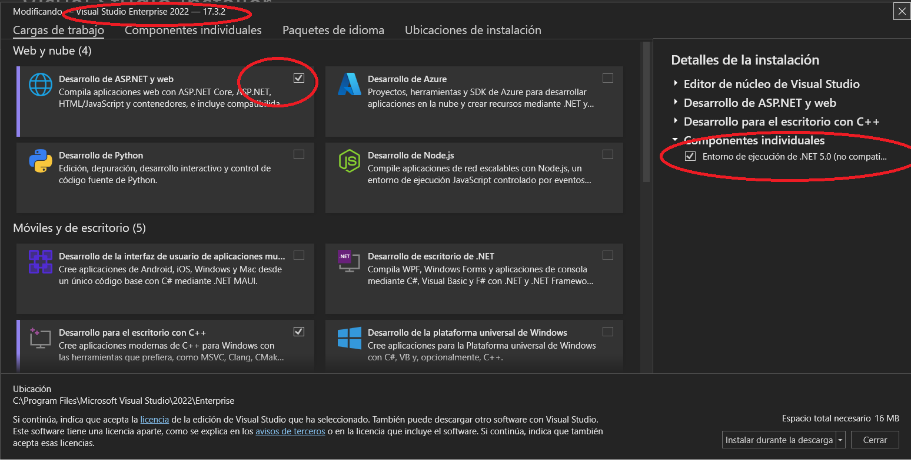
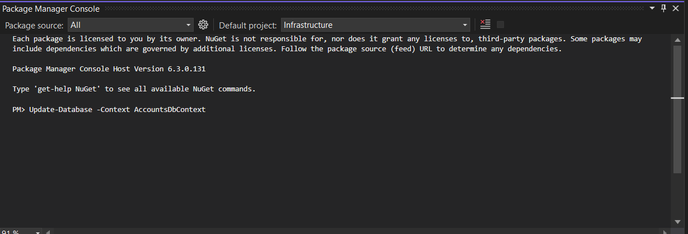
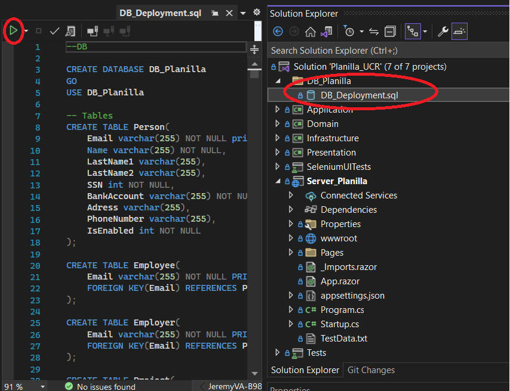

## Execution instructions
1) Clone the repository locally, using Visual Studio

2) Make sure you have .net 5.0 installed and ASP.net web development

3) Right click on the Server_Planilla project and select it as the start project

4) With the web server as the default project. and the selected infrastructure layer.
From the Package manager console run:
Update-Database -Context AccountsDbContext

5) Run Planilla data base using vs options

6) Click on the button to run using ISSExpress

